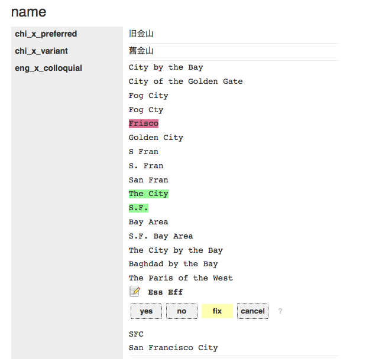

# js-whosonfirst-yesnofix



A little bit of Javascript love to make arbitrary data structures [Yes No Fix](https://mapzen.com/blog/yesnofix/) -able.

## tl;dr

Opinions and fact-checking. About stuff. As CSV documents. From any webpage. Or at least [Who's On First Spelunker](https://whosonfirst.mapzen.com/spelunker/) webpages. With [code](https://github.com/whosonfirst/js-mapzen-whosonfirst-yesnofix).

## How to use `yesnofix.js`

### The short version

First grab a copy of the code from the [js-mapzen-whosonfirst-yesnofix GitHub repository](https://github.com/whosonfirst/js-mapzen-whosonfirst-yesnofix). Then add it to your webpages, like this:

```
<link rel="stylesheet" type="text/css" href="mapzen.whosonfirst.yesnofix.css" />
<script type="text/javascript" src="mapzen.whosonfirst.yesnofix.js"></script>
```

The simplest way to use `yesnofix.js` is to call the `apply` method with a target HTML element and a data structure. This will generate a pretty HTML table complete with Yes No Fix style controls for each value and insert it in to the DOM as a child of the target HTML element you've defined.

```
mapzen.whosonfirst.yesnofix.apply(data, target_el);
```

If you just want to render a data structure but delay or defer adding it to the DOM you can call the `render` method.

```
var pretty = mapzen.whosonfirst.yesnofix.render(data);
```

That's it. By default every element in your data structure will be made Yes No Fix -able.

### The long version

For now, the best place to get all the details about Yes No Fix (and how to use it) is [our blog post](https://mapzen.com/blog/yesnofix/) announcing the project.

## See also

* https://mapzen.com/blog/yesnofix/
* http://buildinginspector.nypl.org/
