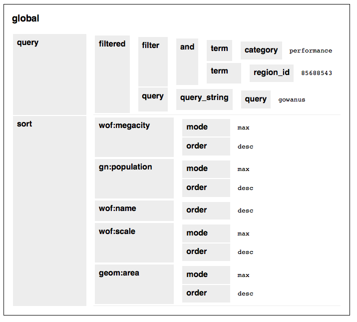

# js-whosonfirst-yesnofix

A little bit of Javascript love to make arbitrary data structures yes-no-fix-able.

## Caveat

This library is still in active development. It may change. It may not work. It definitely isn't properly documented yet.

## Example

```
    <div id="yesnofix"></div>

    <script type="text/javascript">

      var data = {
	"query": {"filtered": {"filter": {
		"and": [
		       {"term": {"category": "performance"}},
		       {"term": {"region_id": 85688543}}
		       ]},
      		"query": {"query_string": {"query": "gowanus"}}}},
	"sort": [
		{"wof:megacity": {"mode": "max", "order": "desc"}},
		{"gn:population": {"mode": "max", "order": "desc"}},
		{"wof:name": {"order": "desc"}},
		{"wof:scale": {"mode": "max", "order": "desc"}},
		{"geom:area": {"mode": "max", "order": "desc"}}],
      };

      var target = "yesnofix";

      if (! mapzen.whosonfirst.yesnofix.makeitso(data, target)){
      	alert("failed to render data");
      }

    </script>
```

_See the way we're calling a method called `makeitso` ? Yeah, so stuff like that. Stuff like that will change._

### Uh okay... now what?

Did we mention this library is still in active development? Okay. When you run the code above two things will happen. First your data structure will be "pretty-printed" in to a series of nested tables. Right now they're pretty ugly but the goal is to have something that you can look at without getting a headache. Like this:



The second thing that will happen is that each value at the _end_ of each path in your data structure will become active. As of this writing all that happens when you click a value is an alert dialog displaying the nested path and the value you clicked. Like this:


## See also

* http://buildinginspector.nypl.org/about
